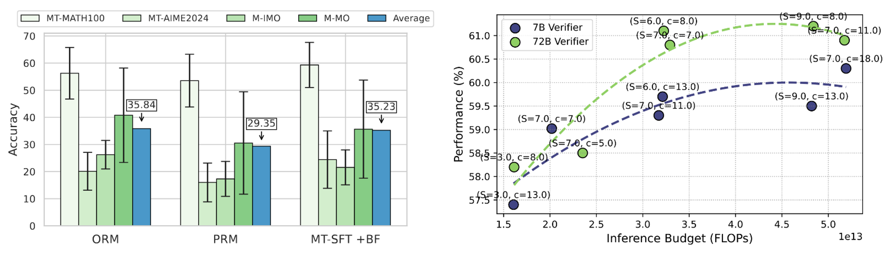

# MCLM: Linguistic Generalizability of Test-Time Scaling in Mathematical Reasoning

<div align="center">
  
</div>

This repository is the official implementation of "Linguistic Generalizability of Test-Time Scaling in Mathematical Reasoning".
- 📝 Paper: *Coming Soon*
- 🖥️ MCLM: https://huggingface.co/datasets/amphora/MCLM
- 🖥️ MR-1 SFT Dataset: https://huggingface.co/datasets/amphora/Open-R1-Mulitlingual-SFT

## 1. Evaluation
You can customize own evaluation configuration on `eval.yaml`.
- `models(list)`: Model list to evaluate.
- `datasets(list)`: Dataset list to evaluate. Default value is `["math100", "aime2024", "IMO", "MMO"]`.
- `language_type(str, int, or list)`: Language type to evaluate. Entire languaes will be wevaluated if `None` was given.
- `output_path(str)`: Output directory path to save the results.
※ You need to provide `OPENAI_API_KEY` and `HF_TOKEN` in `eval.yaml`.
```
bash scripts/run_eval.sh
```

## 2. Scoring
### 2-1. MATH100 and AIME2024 Scoring
- `root_path(str)`: Default value is `results`.
- `models(list)`: Model list to evaluate.
- `datasets(list)`: Dataset list to evaluate. All datasets in directory will be evaluated if `None` was given.
- `languages(list)`: Language list to evaluate. All languages in directory will be evaluated if `None` was given.
```
bash scripts/run_score.sh
```

## 2-2. Mathematical Olympiad Scoring (litellm)
- `path_list(list)`: Path list to evaluate the results.
- `models(list)`: Model list to evaluate.
- `datasets(list)`: Dataset list to evaluate. The default value is `["IMO", "MMO"]`.
- `languages(list)`: Language list to evaluate. The default setting evaluates entire languages for IMO and MMO, respectively.
- `judge(str)`: Judge model to evaluate the models' responses. The default value is `gpt-4o-mini`.
※ You need to provide `OPENAI_API_KEY` and `HF_TOKEN` in `scripts/mo_score_litellm.sh`.

```
bash scripts/mo_score_litellm.sh
```

## 2-3. Mathematical Olympiad Scoring (OpenAI batch API)
- `models(list)`: Model list to evaluate.
- `datasets(list)`: Dataset list to evaluate. The default value is `["IMO", "MMO"]`.
- `languages(list)`: Language list to evaluate. The default setting evaluates entire languages for IMO and MMO, respectively.
- `judge(str)`: Judge model to evaluate the models' responses. The default value is `gpt-4o-mini`.
- `score_type(str)`: Scoring type. There are `["data_collect", "send_batch", "receive_batch", "score"]`, and they should be providede and executed in order.
※ You need to provide `OPENAI_API_KEY` and `HF_TOKEN` in `scripts/mo_score.sh`.
```
bash scripts/mo_score.sh
```

## 3. Language Consistency Score(LCS)
**Arguments**
- `root_path(str)`: Default value is `results`.
- `models(list)`: Model list to measure the LCS. All models in directory will be evaluated if `None` was given.
- `datasets(list)`: Dataset list to measure the LCS. All datasets in root_path will be evaluated if `None` was given.
- `languages(list)`: Language list to measure the LCS. All languages (55) will be evalyated if `None` was given.
- `output_path(str)`: Default value is `lcs_results`.

```
bash scripts/run_lcs.sh
```
